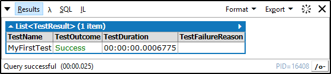

# LinqPadMiniUnitTests
Run very simple mini-tests for your code on LinqPad

Just the other day I was using [LinqPad](https://www.linqpad.net/) to write what began as a very simple method. The goal was to export some data into a specific format. The more I developed, the more corner cases I was finding about the expected output. This got me thinking: if I were using Visual Studio, I would certainly be doing some red-green TDD. Yet, this seemed like such a simple method, that I didn't think I would require it. Oh boy, was I wrong. You always need to test your code, to make sure that your changes do not break any corner cases, catching you blindsided. This got me thinking: I wish there was an easy way to write small *unit tests* on LinqPad. 

## Compatibility
I tested this project using both [LinqPad 5](https://www.linqpad.net/Download.aspx) and [LinqPad 4](https://www.linqpad.net/Download.aspx), with and without a licence.

## Easy setup: copy-paste
LinqPad has this great functionality: **My Extensions**. You can find it on **My Queries**:


All you have to do to be able to use this project is copy the contents of [src/MyExtensions.cs](src/MyExtensions.cs) and **append** them to your **My Extensions** file.

The result will be something like this (keep in mind the code itself may change with future versions):


Once you **save** it, either LinqPad will tell you **Query compiled successfully** or there will be an error that a file could not be accessed. If this is the case, please close all queries that you have open, and then make any change to your **My Extensions** (press space and then backspace), and **save** again.

You are now ready to use **LinqPad Mini Unit Tests**

## Easy usage
In order for you to use **LinqPad Mini Unit Tests** you should create any class on your code, make it implement the interface **IUnitTests** and return a list of **Test** objects.
* Each **Test** may or may not have a name;
* Each **Test** should have some **Code** to be run;
* The **Code** a **Test** runs will return a **string**: empty string for **Success** and a non-empty string for failure. The content of the non-empty string is the failure reason;

First the class that will contain our tests with the minimal implementation of **IUnitTests**:
```csharp
public class MyTests : IUnitTests {
	public List<Test> Tests { 
		get { 
			return new List<Test>(); 
		}
	}
}
```

Second we write a unit test:
```csharp
public class MyTests : IUnitTests {
	public List<Test> Tests { 
		get { 
			return new List<Test> { 
				new Test {
					Name = "My first test",
					Code = MyFirstTest,
				}
			}; 
		}
	}
	
	private string MyFirstTest() {
		// Setup
		var a = 4;
		var b = 5;
		
		// Act
		var result = a + b;
		
		// Assert
		if (result == 9)
			return string.Empty;
		else
			return string.Format("Unexpected result: {0}", result);
	}
}
```

Third, in the **Main** method, we invoke our unit test runner:
```csharp
void Main() {
	new MyTests().RunTests();
}
```

And there you go, this will be the output:


## A little more complex example

The test runner will also provide you with the execution times and outcomes. For example:
```csharp
public class MyTests : IUnitTests {
	public List<Test> Tests { 
		get { 
			return new List<Test> {
				new Test { 
					Name = "Test one", 
					Code = AlwaysSucceed,
				},
				new Test {
					Name = "Test without code",
				},
				new Test {
					Name = "Some error!",
					Code = AlwaysFail,
				},
				new Test {
					Name = "Slow running test",
					Code = SlowRunningTest,
				},
			};
		}
	}
	
	private string AlwaysSucceed() {
		return string.Empty;
	}
	
	private string AlwaysFail() {
		return "Why must I always fail?";
	}
	
	private string SlowRunningTest() {
		Thread.Sleep(TimeSpan.FromSeconds(1));
		return string.Empty;
	}
}
```

The output will be:


## Special Thanks
I want to thank [TFV](http://www.tfv.pt) for getting me hooked on LinqPad and giving me the time to give back to the community.

## Future Work
* Use attributes to mark functions as tests (like MSTest [TestMethod] attribute);
* Create an Assert class/namespace to facilitate asserts (like every unit test framework has!);
* Allow Tests to explicitly fail with an exception (like MSTest [ExpectedException] attribute);
* Come up with a way to capture the console output for each test separately;
