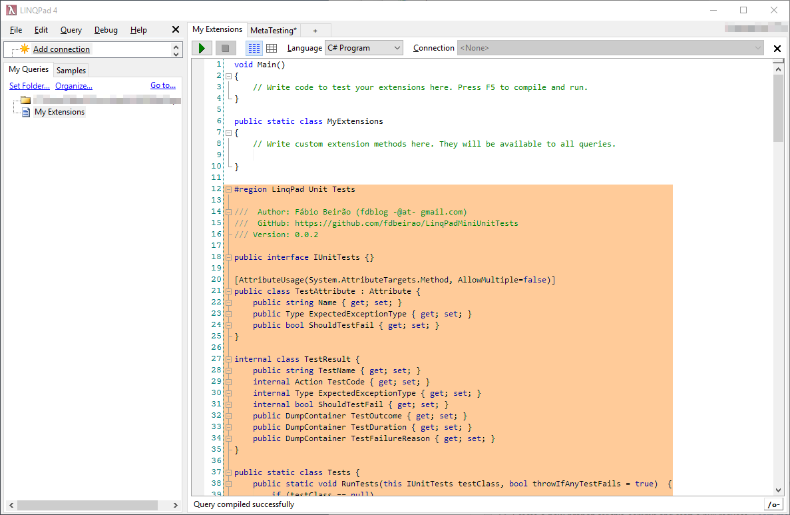

# LinqPadMiniUnitTests
Run very simple mini-tests for your code on LinqPad

Just the other day I was using [LinqPad](https://www.linqpad.net/) to write what began as a very simple method. The goal was to export some data into a specific format. The more I developed, the more corner cases I was finding about the expected output. This got me thinking: if I were using Visual Studio, I would certainly be doing some red-green TDD. Yet, this seemed like such a simple method, that I didn't think I would require it. Oh boy, was I wrong. You always need to test your code, to make sure that your changes do not break any corner cases, catching you blindsided. This got me thinking: I wish there was an easy way to write small *unit tests* on LinqPad.

-------------------
## Compatibility

I tested this project using both [LinqPad 5](https://www.linqpad.net/Download.aspx) and [LinqPad 4](https://www.linqpad.net/Download.aspx), with and without a licence.

-------------------
## Easy setup: copy-paste

LinqPad has this great functionality: **My Extensions**. You can find it on **My Queries**:


All you have to do to be able to use this project is copy the contents of [src/MyExtensions.cs](src/MyExtensions.cs) and **append** them to your **My Extensions** file.

The result will be something like this (keep in mind the code itself may change with future versions):


Once you **save** it, either LinqPad will tell you **Query compiled successfully** or there will be an error that a file could not be accessed. If this is the case, please close all queries that you have open, and then make any change to your **My Extensions** (press space and then backspace), and **save** again.

You are now ready to use **LinqPad Mini Unit Tests**

-------------------
## Easy usage

In order for you to use **LinqPad Mini Unit Tests** you should create a class on your code and make it implement the interface **IUnitTests**.

* Create a class that will contain our tests:
```csharp
public class MyTests { }
```

* Write a test. Notice it should have the **[Test]** attribute:
```csharp
public class MyTests {
	[Test]
	public void MyFirstTest() {
		// Setup
		var a = 4;
		var b = 5;

		// Act
		var result = a + b;

		// Assert
		Assert.AreEqual(expected: 9, actual: result);
	}
}
```

* In the **Main** method, we invoke the unit test runner:
```csharp
void Main() {
	Tests.RunTests();
}
```

And there you go, this will be the output:


-------------------
## A little more complex example

The test runner will also provide you with the execution times and outcomes. For example:
```csharp
void Main() {
	Tests.RunTests();
}

public class Test_UnitTests {
	[Test]
	public void Test_AreEqual() {
		// Setup
		var someString = "foo";
		// Act
		someString += "bar";
		// Assert
		Assert.AreEqual(expected: "foobar", actual: someString);
	}

	[Test]
	public void Test_AreNotEqual() {
		// Setup
		var someString = "foo";
		// Act
		someString += "bar";
		// Assert
		Assert.AreNotEqual(notExpected: "xpto", actual: someString);
	}

	[Test(ShouldTestFail=true)]
	public void Test_AssertFail() {
		// Assert
		Assert.Fail("This test should fail!");
	}

	[Test(ExpectedExceptionType=typeof(Exception))]
	public void Test_ExpectedException() {
		// Act
		throw new Exception("This exception is expected! This test should pass.");
		// Assert
		Assert.Fail("This test should not have failed, the exception was expected");
	}

	[Test(ExpectedExceptionType=typeof(Exception), ShouldTestFail=true)]
	public void Test_FailIf_ExpectedExceptionIsNotThrown() {
		// Nothing to do, this test should fail because no exception was thrown
	}
}
#endregion
```

The output will be:


-------------------
## Special Thanks

I want to thank [TFV](http://www.tfv.pt) for getting me hooked on LinqPad and giving me the time to give back to the community.

-------------------
## Future Work

* ~~Use attributes to mark functions as tests (like MSTest [TestMethod] attribute);~~ :white_check_mark: v 0.0.2
* ~~Create an Assert class/namespace to facilitate asserts (like every unit test framework has!);~~ :white_check_mark: v 0.0.2
* ~~Allow Tests to explicitly fail with an exception (like MSTest [ExpectedException] attribute);~~ :white_check_mark: v 0.0.2
* Come up with a way to capture the console output for each test separately;
* Allow the usage of Task and async;

-------------------
## Release notes
### v1.0.0
* Inspiration from xUnit and just construct a new instance of the class for each test that is run;
* Remove `IUnitTests` interface;
* Static method to find and run all tests: `Tests.RunTests();`
